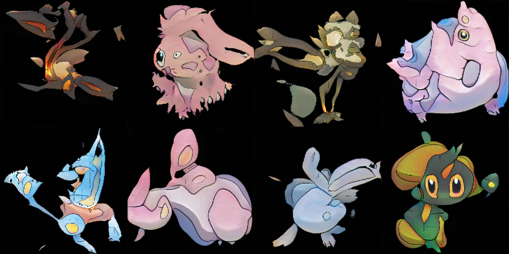

### Hi there 👋
I'm studying machine learning and generating Pokémon.  
I also like virtual currency, Ethereum. I'm also a rare Solidity engineer. [Output example]: https://github.com/enpitut2021/ramen-contracts

You can find repositories in this field by entering the following in the repository search bar  
__Basics_of_machine_learning__: implementations of theoretical machine learning with a strong mathematical component.  
__Tensorflow_and_Keras__: Implementations using Tensorflow or Keras.

機械学習を勉強したり、ポケモンを生成したりしています。  
仮想通貨、Ethereumも好きです。珍しいSolidityエンジニアでもあります。[Output例]: https://github.com/enpitut2021/ramen-contracts

リポジトリの検索バーに以下を入れると、その分野のリポジトリを見つけることができます。  
__Basics_of_machine_learning__: 数学的要素が強い理論的な機械学習を実装したもの。  
__Tensorflow_and_Keras__: TensorflowやKerasを利用して実装したもの。

<!--
**n-yuzuto/n-yuzuto** is a ✨ _special_ ✨ repository because its `README.md` (this file) appears on your GitHub profile.

Here are some ideas to get you started:

- 🔭 I’m currently working on ...
- 🌱 I’m currently learning ...
- 👯 I’m looking to collaborate on ...
- 🤔 I’m looking for help with ...
- 💬 Ask me about ...
- 📫 How to reach me: ...
- 😄 Pronouns: ...
- ⚡ Fun fact: ...
-->
